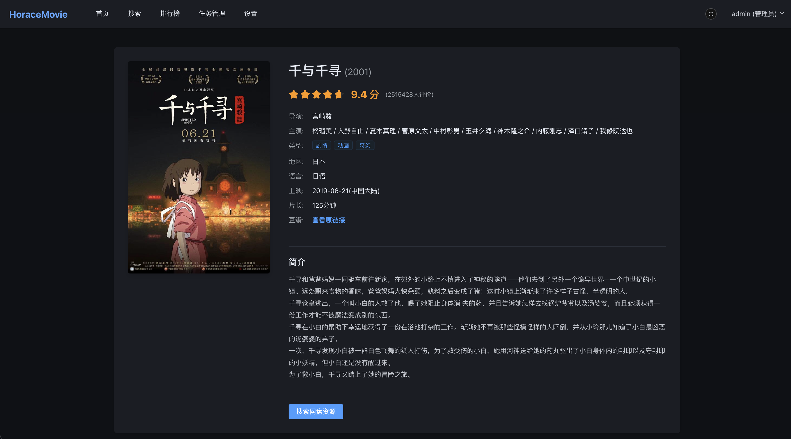

# HoraceMovie

一个用于影视资源浏览、搜索与追踪的个人系统，覆盖资源检索、网盘转存、任务追踪与消息通知等核心流程。



## 功能概览

- 资源浏览：通过 DouBan 浏览影视资源列表和详情。
- 资源搜索：通过 PanSou 网盘搜索接口，支持多网盘资源聚合。
- 网盘转存：将影视资源一键转存到个人网盘（目前支持 115 和 Quark）。
- 任务追踪：支持对资源进行 Cron 追踪，新增内容自动转存并通知。
- 通讯工具：可接入 Telegram Bot 进行搜索、转存、推送与追踪。
- 任务管理：提供 OpenList 跨存储同步（如网盘到本地、NAS）任务与资源追踪（如追剧）任务管理。

## 快速开始

推荐使用 Docker Compose 进行一键部署。

```yaml
services:
  backend:
    image: leaosunday/horacemovie-backend:latest
    container_name: horacemovie-backend
    ports:
      - "8008:8008" # 后端端口，不想暴露可以注释掉
    volumes:
      - ./backend/data:/app/data
    environment:
      NODE_ENV: production
      PORT: "8008"
      DB_PATH: /app/data/horacemovie.db
      ENCRYPTION_KEY: YOUR_ENCRYPTION_KEY # 加密密钥，必填
      TOKEN_SECRET: YOUR_TOKEN_SECRET # Token 密钥，必填
    healthcheck:
      test: ["CMD", "node", "-e", "fetch('http://localhost:8008/api/health').then(r=>process.exit(r.ok?0:1)).catch(()=>process.exit(1))"]
      interval: 10s
      timeout: 3s
      retries: 5
    restart: unless-stopped

  frontend:
    image: leaosunday/horacemovie-frontend:latest
    container_name: horacemovie-frontend
    ports:
      - "8080:80" # 前端端口
    depends_on:
      backend:
        condition: service_healthy
    restart: unless-stopped
```

部署完成后：
- **前后端地址**：`http://localhost:8080`、`http://localhost:8008`
- **admin初始密码**：`docker logs -f horacemovie-backend | grep "Password"`

## 流程示例

1. **基础配置**：
   - 更改用户名和密码：首次登录系统后，进入 **系统设置** 页面，更改默认用户名和密码。
   - 配置 **网盘设置**：填写 115 或 夸克的 Cookie，以及默认转存目录。
   - (可选) 配置 **OpenList 设置**：填写 OpenList 地址、用户名、密码和同步路径，用于后续同步。
   - (可选) 配置 **Telegram**：配置 Bot Token、可用的 Chat IDs（群聊白名单） 与 User IDs（用户白名单）。
   - (可选) 配置 **Discord**：配置 Bot Token、可用的 Channel IDs（频道白名单） 与 User IDs（用户白名单）。

2. **资源检索与转存**：
   - 在 **首页** 、 **搜索** 或 **排行榜** 页面查找影视资源。
   - 选中合适的资源，点击 **一键转存**。系统会自动将资源保存到你配置的网盘中。

3. **自动化同步（可选）**：
   > 如果配置了 **OpenList 同步**，会自动将资源添加到 OpenList 同步任务队列中。
   - 在 **任务管理** 中查看同步进度。
   - 转存成功后，系统可配合 OpenList 自动触发同步任务，将资源拉取到你的本地存储。

4. **持续追踪（可选）**：
   - 在 **追踪管理** 中查看追踪进度。
   - 系统将定期检查更新，发现新资源后自动完成搜索与转存流程。

5. **通讯工具集成（可选）**：
   > 如果配置了 **Telegram / Discord Bot** 等机器人，会自动通知转存、同步结果。
   - 在 Telegram / Discord Bot 进行资源搜索、转存。
   - 转存、同步和追踪等任务完成后会通过机器人进行通知

## 配置说明

- 搜索接口：在系统设置中填写可用的 Pansou 搜索地址（如 localhost:8888）。
- 网盘设置：配置网盘 Cookie、默认转存目录以及 OpenList 对应的挂载路径。
- Telegram 配置：配置 Bot Token、可用的 Chat IDs（群聊白名单） 与 User IDs（用户白名单）。
- Discord 配置：配置 Bot Token、可用的 Channel IDs（频道白名单） 与 User IDs（用户白名单）。
- OpenList 配置：配置服务地址、账号信息与默认同步路径。

## 许可证

MIT License
